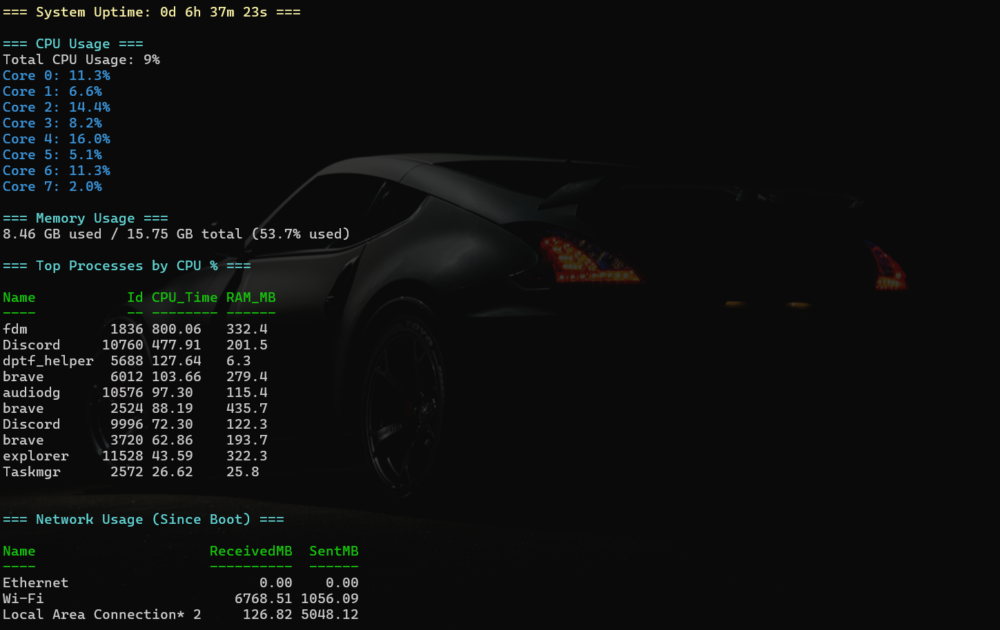

# Windows Htop

A simple and lightweight PowerShell-based system monitor for Windows, inspired by the Unix `htop` tool.  
It provides a clean, terminal-style overview of your system's resource usage, top processes, and network stats.



## 📊 Features

- ✅ System Uptime
- ✅ Per-core CPU usage
- ✅ Memory usage (used vs total)
- ✅ Top processes by CPU time
- ✅ Network usage since boot
- ✅ Clean and readable terminal output

---

## 🛠 How It Works

This script fetches real-time performance stats using built-in PowerShell commands and WMI (Windows Management Instrumentation).  
It summarizes the system load in a human-friendly way, ideal for quick diagnostics or a minimalist system overview.

---

## 🚀 Usage

You can run the script directly using PowerShell:

```powershell
iwr -useb https://raw.githubusercontent.com/onslaught2342/htop-windows/main/htop.ps1 | iex
```

> ⚠️ Note: Ensure your execution policy allows running scripts. If not, run:
>
> ```powershell
> Set-ExecutionPolicy -Scope Process -ExecutionPolicy Bypass
> ```

---

## 📷 Sample Output

```
=== System Uptime: 0d 6h 37m 23s ===

=== CPU Usage ===
Total CPU Usage: 9%
Core 0: 11.3%
Core 1: 6.6%
Core 2: 14.4%
...

=== Memory Usage ===
8.46 GB used / 15.75 GB total (53.7% used)

=== Top Processes by CPU % ===
Name         Id     CPU_Time    RAM_MB
fdm          1836   800.06      332.4
Discord     10760   477.91      201.5
...

=== Network Usage (Since Boot) ===
Name                     ReceivedMB  SentMB
Wi-Fi                   6768.51     1056.09
Local Area Connection*2 126.82      5048.12
```

## 

## 🧠 Why "Windows Htop"?

Because Task Manager is nice, but sometimes you just want to get **nerdy with numbers** in the terminal.

---

## 🖤 License

This project is licensed under the [Creative Commons Attribution 4.0 International (CC BY 4.0)](https://creativecommons.org/licenses/by/4.0/).

You are **free to use, modify, and share** this project — just **credit** the original author:

**Created by [Onslaught2342](https://github.com/onslaught2342)**

---

## 🙌 Credits

Created by [Onslaught2342](https://github.com/onslaught2342)

```

```
